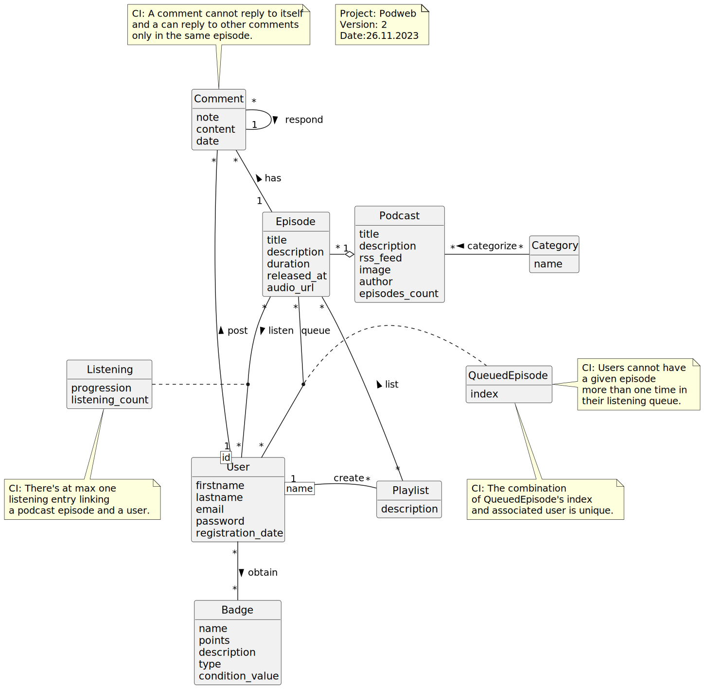

# Modèle logique de données - Podweb

## Changement du MCD - Version 2

Comme demandé par notre enseignant, nous avons ajouté 2 tables supplémentaires au MCD et donc au MLD et fait les modifications suivantes depuis le dernier rendu:
1. Les badges obtenus par des utilisateurs
1. Les commentaires postés par des utilisateurs sur des épisodes, répondant potentiellement à d'autres commentaires dans le même épisode.
1. Ajout de la date de création de compte dans User (utile pour un des types de badges)

## MLD - Version 2
Notre MLD a été fait dans MySQL Workbench et correspond au MCD v2, les contraintes plus avancées non visibles ont été également configurées. Elles sont visibles dans le SQL.

## SQL
Nous avons utilisé l'export SQL depuis MySQL Workbench pour générer le script SQL de création du schéma de la base de données, voir fichier `podweb-schema.sql`.

## Badges
Nous allons développer un système de *badges* attribués aux utilisateurs quand ils atteignent certains niveaux d'engagement sur Podweb. La liste détaillées des badges sera définie plus tard, mais voici 2-3 exemples qui justifient notre modèle de donnée.
| Type             | Name         | Points        | Condition        | Description                                                      |
| ---------------- | ------------ | ------------- | ---------------- | ---------------------------------------------------------------- |
| ListeningCount   | PetaListener | 100000000 pts | 10000 listenings | You are a peta listener, do you even have a life ?               |
| RegistrationDate | BabyCaster   | 100 pts       | 1 month passed   | You are not new as a month ago...                                |
| RegistrationDate | TeenCaster   | 300 pts       | 6 months passed  | Starting to rebel as a teen listening to podcasts instead of TV. |

Les 4 types suivants sont possibles:
1. `ListeningCount`: le badge sera attribué à partir d'un certain **nombre d'écoutes d'épisodes** (2 écoutes du même épisode compte bien 2 fois)
1. `RegistrationDate`: le badge sera attribué à partir d'un certain **temps passé après la date de création de compte**
1. `PlaylistCreation`: le badge sera attribué à partir d'un certain nombres **de playlists créées**
1. `CommentsCount`: le badge sera attribué à partir d'un certain nombres de **commentaires postés**

L'attribution des badges pourra probablement se faire via des triggers développé en SQL qui s'exécutera à chaque fois qu'une écoute est ajoutée par ex.

Ce fonctionnement nous on permit de définir les besoins de champs name, type, points, description and condition_value sur les badges dans notre MCD et MLD.