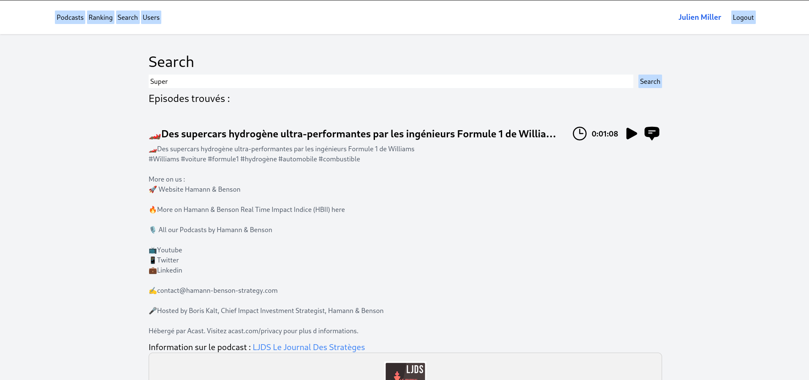

# Podweb
Réalisé par Arthur Junod, Samuel Roland et Edwin Häffner
<!-- TODO : faire une jolie page de titre avec saut de page ! -->
<!-- TODO : inclure photo de l'app sur la page de titre ! -->
<!-- TODO : faire un joli export -->


<p style="page-break-before: always"></p>

## Introduction

Dans le cadre du cours de base de données relationnelles, il nous a été demandé de réaliser une application qui utilise une base donnée.
Certaines implémentations nous ont été imposées comme l'utilisation de toutes les opérations CRUD, la création et utilisation de vues et la 
création et utilisation de triggers. Il fallait également une UI qui nous permet de modifier la base de donnée.

Nous avons donc réalisé un projet de développement d'une application web en Java permettant d'écouter et d'interagir avec des podcasts, ajouter des commentaires,
des notes, etc.

## Fonctionnalités

Notre application web permet de faire les choses suivantes :

1. Parcours des podcasts et de leurs épisodes. On peut voir l'image des podcasts, le nombre d'épisodes publiés ainsi que leur auteur.

2. Recherche fulltext des épisodes (titre, description, auteur, titre du podcast) et affichage des résultats.

3. Ranking des podcasts les plus écoutés

4. Lors de l'écoute d'un épisode, l'application sauvegarde toutes les 15 secondes la progression de l'écoute dans la base de données.
   Permet de reprendre l'écoute là où on s'était arrêté.

5. Possibilité de se connecter avec des identifiants déjà existants pour pouvoir commenter et noter les épisodes et sauvegarder les progressions
   d'écoute.

6. Commenter les épisodes et répondre à d'autres commentaires.

7. Possibilité de voir son profil et les badges obtenus (badges d'écoute, de commentaires, etc.)

## Utilisation

### Accueil

La page d'accueil affiche tous les podcasts avec leur image, titre, auteurs et nombres d'épisodes.
Les boutons en haut de la page nous permettent de se déplacer dans les autres vues décrites par ces boutons.
Si l'on est connecté notre nom d'utilisateur est affiché à côté du bouton `Login` et il est possible de cliquer dessus
pour accéder à notre page d'utilisateur.
Cliquer sur un podcast nous amène à la page qui affiche les détails de celui-ci.


La page d'accueil une fois connecté


### Détail d'un podcast

Dès qu'on clique sur un podcast, on arrive sur la page de celui-ci (lien : `/podcast/<id>`) .
On peut y voir l'image du podcast en question et une liste de tous les épisodes à la suite avec leur titre, description et durée. 

On peut ensuite cliquer sur l'un des épisodes que l'on veut écouter, soit sur le nom en lui-même ou bien en cliquant sur l'icône play à côté du titre.


### Detail d'un épisode

L'affichage d'un podcast se fait par l'affichage de son nom, sa description et sa durée.
C'est ici qu'on peut écouter un épisode avec un simple lecteur audio et également voir les commentaires et les notes liés celui-ci.
Si on est connecté, on peut aussi voir le nombre d'écoutes que l'on a pour cet épisode et 
nous même commenter, noter l'épisode et répondre à d'autres commentaires.


La page d'un épisode une fois connecté


### Ranking

La page ranking peut être atteinte à tout moment depuis le bouton `Ranking` en haut de la page.
On y voit une liste qui classe les podcasts par leur nombre d'écoutes.
Chaque podcast a son titre, son image, son auteur et son nombre d'écoutes affiché.
On peut toujours cliquer sur l'un deux pour accéder à ses détails.


### Recherche

À tout moment, on peut cliquer sur le bouton `Search` en haut de la page pour accéder à la page de recherche.
On peut y rechercher des épisodes en fonction de leur titre, description, auteurs ou encore titre de podcast. 

On obtient alors une liste d'épisodes qui correspondent à la recherche suivie d'une description du podcast lié à celui-ci et une image du podcast. On peut cliquer sur un épisode pour accéder à sa page de détail ou bien, on peut cliquer sur le podcast correspondant à l'épisode pour arriver sur la page de détail d'un podcast.

Une recherche réussite



Une recherche sans résultats


### Page de connection

Cette page nous permet de nous connecter en tant qu'utilisateur de podweb.


### Liste d'utilisateurs

La page `Users` (lien : `/users`) permet de lister tous les utilisateurs de *Podweb*.
On peut cliquer sur chaque utilisateur afin d'accéder à leur page.


### Page utilisateur

La page utilisateur affiche le nom et prénom de l'utilisateur choisi, sa date d'inscription, la liste des badges qu'il a 
obtenues et la liste des playlists qu'il a créées.


## Données


## Implémentation

### Base de données

Nous avons utilisé PostgreSQL pour la base de données. Nous avons créé 12 tables, mais nous n'en utilisons
que 10 dans l'application pour des raisons de temps et de complexité d'implémentation.


Les tables `categories` et `queue` ne sont pas utilisées dans l'application, mais sont encore présentes dans la base de
données. Pour d'éventuelles futures améliorations.

#### Origines des données

Pour ne pas devoir créer à la main ou générer des données de développement, nous allons utiliser quelques milliers d'enregistrements de la base de données publique et ouverte du registre PodcastIndex. Ce registre répertorie plus de 4 millions de podcasts, nous allons en prendre qu'une toute petite partie parmi les podcasts et de leurs épisodes.

La base de données ([téléchargeable ici](https://public.podcastindex.org/podcastindex_feeds.db.tgz)) fait déjà 4 Go et ne contient malheureusement pas les épisodes. Il nous faut donc aller les chercher via leur API ou directement via leur flux RSS. Les catégories sont définies dans 10 attributs de la table podcasts, il nous faut en conséquence les extraire et créer les catégories et les associations vers chaque podcast. 

Pour se faire nous avons créer deux script python :
- `scrap_episodes_script.py` qui permet de récupérer les épisodes pour chaque podcast dans la base de donnée téléchargée.
- `json_to_sql.py` qui transforme les fichier .json des podcasts et épisodes en sql qui INSERT dans les tables de notre db les épisodes, les podcasts, les catégories et fait le lien entre chaque podcast et catégories en remplissant la table `categorize`.

Il nous restera ainsi à générer aléatoirement des utilisateurs et des playlists avec des épisodes, des écoutes d'épisodes pour chaque utilisateur. Une partie des utilisateurs auront déjà des files d'attentes remplies avec quelques épisodes. Au final, nous aurons donc une base de données légère avec seulement les attributs des podcasts qui nous intéressent et les autres tables.

#### Badges
Nous allons développer un système de *badges* attribués aux utilisateurs quand ils atteignent certains niveaux d'engagement sur Podweb. La liste détaillées des badges sera définie plus tard, mais voici 2-3 exemples qui justifient notre modèle de donnée.
| Type             | Name         | Points        | Condition        | Description                                                      |
| ---------------- | ------------ | ------------- | ---------------- | ---------------------------------------------------------------- |
| ListeningCount   | PetaListener | 100000000 pts | 10000 listenings | You are a peta listener, do you even have a life ?               |
| RegistrationDate | BabyCaster   | 100 pts       | 1 month passed   | You are not new as a month ago...                                |
| RegistrationDate | TeenCaster   | 300 pts       | 6 months passed  | Starting to rebel as a teen listening to podcasts instead of TV. |

Les 4 types suivants sont possibles:
1. `ListeningCount`: le badge sera attribué à partir d'un certain **nombre d'écoutes d'épisodes** (2 écoutes du même épisode compte bien 2 fois)
1. `RegistrationDate`: le badge sera attribué à partir d'un certain **temps passé après la date de création de compte**
1. `PlaylistCreation`: le badge sera attribué à partir d'un certain nombres **de playlists créées**
1. `CommentsCount`: le badge sera attribué à partir d'un certain nombres de **commentaires postés**

#### Remarques

1. Podcast
	- `episodes_count`: ce champ ne peut pas être déduit du nombre d'épisodes stockés car c'est le nombre total. Nous n'allons pas forcèment stocker la totalité des épisodes parce que certains podcasts ont des milliers d'épisodes. Cette valeur provient de la base de données Podcastindex.org et sert à l'affichage dans la liste des podcasts.
	- `author`: Dans la base de données PodcastIndex, nous avons uniquement le nom (`itunesAuthor`) par ex. `Kevin Zade` et (`itunesOwnerName`) par ex. `One Brew Over the Cuckoos Nest`. Nous avons considéré le fait d'avoir une entité `authors` mais il n'y aurait que 2 champs, et s'il y a 2 personnes avec les mêmes noms on ne pourrait pas les différencier. Nous allons donc juste garder la valeur de `itunesAuthor` dans `author` et cela n'empêche pas la recherche de podcasts par le nom d'auteur.

1. Listening
   - `listening_count` est le nombre total d'écoute entre un utilisateur et un épisode. Cette valeur est incrémentée chaque fois que l'écoute atteint 100%.

### Java stack
Voici les outils que nous utilisons pour implémenter notre application web en Java :
1. Javalin : un petit framework web léger et rapide
2. Gradle : nous voulions tester autre chose que Maven pour gérer les dépendances, les builds et l'exécution de tests, nous avons pris son alternative.
3. [JTE](https://jte.gg/) : système de template permettant d'écrire facilement des vues en HTML
4. TailwindCSS : un framework CSS très puissant et orienté sur des classes utilitaires
5. JUnit : le classique framework de test en Java

### Différences avec cahier des charges

Toutes ces différences peuvent principalement être expliquées par le manque de temps. Ces fonctionnalités non-implémentées
ont été laissées de côtés au profit de certaines qui nous semblaient plus urgentes ou importantes à implémenter.

- Nous voulions implémenter des catégories et les utiliser dans le ranking, la recherche et l'affichage des podcasts.
Elles sont malgré tout présentes dans la base de données et elle catégorisent justement les podcasts, elles ne sont juste
pas manipulées ou utilisées dans l'UI.
- Le ranking n'affiche pas l'épisode le plus écouté. Cependant, la vue qui liste 
les épisodes avec leurs écoutes est présente et pourrait être utilisée pour trouver facilement l'épisode le plus écouté par podcast.
- Pareillement le nombre total d'écoutes n'est pas affiché par épisode, même si la vue citée au-dessus permet de le faire.
- La file d'attente n'est pas présente. Nous avons priorisé les commentaires pour les opérations CRUD.
- On ne peut pas gérer des playlists.
- Un compte ne peut pas être créé ou supprimé.

Dans la première version du cahier des charges les commentaires et les badges n'apparaissaient pas. Ils ont été rajouté par la suite
respectivement pour augmenter le nombre de tables de la base de données et pour implémenter des triggers.

Les triggers des badges en relations avec les playlists ne marchent donc pas, car elles ne peuvent pas être créées.

### Modèles

Dans notre application, nous devons communiquer avec la base de données. Ne pouvant pas utiliser d'ORM, 
nous en avons fait un plus simple de toute pièce.

Chaque modèle implémente la classe `Model`. Cette classe abstraite permet de fournir plusieurs des requêtes SQL communes à
tous les modèles qui l'implémente. Cette classe marche un unison avec la classe `Query` dont une instance est créée dans chaque
modèle, c'est sur cette instance que `Model` exécute ses requêtes. 

`Query` est la classe qui va permettre de faire le lien entre les classes java modèles que nous avons créés et les tables de
la base de donnée. 

Elle nous permet :
1. De mapper directement les colonnes et la table aux paramètres de notre classe ou inversement.
2. De garder la configuration pour la connection à la base de données en "mémoire".
3. De transformer le `ResultSet` que nous renvoie *JDBC* en une `ArrayList<Object>` plus simple à manipuler et utiliser avec *JTE*.

### Operations sur la base de donnée (CRUD)

Nous avons implémenté les opérations CRUD dans ces situations : 

#### Création :

- Création d'un nouveau commentaire → Méthode create de `Model`, utilisé lorsqu'on veut rajouter de nouveau commentaires sous chaque épisode.

#### Délétion :

- Suppression d'un commentaire → Méthode delete de `Model`, utilisé lorsqu'on veut supprimer un commentaire que l'on a posté.

#### Mise à jour :

- Mise à jour de la progression d'écoute d'un épisode → Méthode update de `Model`, utilisé lorsqu'on écoute un épisode et que l'on veut sauvegarder notre progression.

#### Obtention :

- Liste des épisodes, podcasts, utilisateurs, commentaires, badges, playlists, etc. → Méthode all de `Model`, utilisé lorsqu'on veut afficher une liste d'épisodes, de podcasts, etc.

- Un épisode, podcast, utilisateur, commentaire, badge, playlist, etc. → Méthode getBy de `Model`, utilisé lorsqu'on veut afficher un épisode, un podcast, etc, avec un id spécifique.

### Triggers : 

Les triggers sont utilisés pour donner des badges aux utilisateurs. Chaque condition est spécifique à chaque type de badge.

Donc les badges qui sont basés sur le nombre d'écoute n'aura pas le même trigger que celui des commentaires.

Nous en avons défini 4 en tout mais finalement utilisé que 2 (ceux cités au-dessus). Nous ne savions pas quand le trigger pour temps d'inscription devait se faire et comme la gestion de playlists n'a pas été faite nous ne pouvons pas utilisé celui du badge des playlists.

Celui du badge des commentaires se déclenche quand une nouveau commentaire est posté et vérifie si l'utilisateur qui l'a posté à dépassé une des conditions des badges de ce type.

Celui du nombre d'écoute se déclenche quand une nouvelle écoute est enregistrée pour un utilisateur continue de la même manière que celui plus-haut.

### Vues

Nous utilisons les vues dans notre classement afin de savoir le nombre total d'écoutes qu'a chaque podcast.

La vue `episodes_ranking` liste tous les épisode avec leur nombre d'écoutes respectif et les tries selon celui-ci.

La vue `podcasts_ranking` utilise la vue précédente pour récupérer le nombre d'écoute total par podcast et les trier par celui-ci.

### Progression

La progression qui nous permet de retrouver où nous étions dans le podcast après avoir quitté la page est appliquée avec une soustraction de 3 secondes permettant de ne pas reprendre la lecture au milieu d'une phrase sans contexte.

## Développement

### Prérequis
1. JDK 21
2. [NodeJS](https://nodejs.org/en) (pour avoir NPM et ainsi facilement installer TailwindCSS). Ou alors, il est possible d'installer le [CLI Tailwindcss directement également...](https://tailwindcss.com/blog/standalone-cli), dans ce cas les commandes `npm run <x>` ne marcheront pas, mais peuvent être reprise du `package.json`.
3. [Gradle](https://gradle.org/install/) (optionnel, mais recommandé)
4. [Docker](https://docs.docker.com/get-docker/)
5. [NPM](https://www.npmjs.com/get-npm) (utilisé pour mettre à jour le CSS avec TailwindCSS)

## Déploiement
Voici les commandes pour déployer notre application sur un serveur. Les commandes sont à lancer dans le dossier `podweb`.

D'abord, il faut faire un build optimisé pour la production des styles CSS. Le fichier produit est toujours le même : `./app/src/main/static/out.css`, il est cependant minifié pour être le plus léger possible.
```sh
npm run prod
```

Pour builder le projet dans un "fat jar" c'est-à-dire une archive `.jar` qui contient toutes les dépendances utiles en dehors du développement :
```sh
gradle uberJar
```
L'archive générée est présente au chemin suivant : `app/build/libs/app-uber.jar`.

Pour exécuter notre archive avec `java -jar ...`, la variable d'environnement `PODWEB_PRODUCTION` doit être définie, elle permet d'indiquer qu'il faut utiliser les versions compilées des templates JTE chargées dans le JAR et non les chercher dans le dossier originel. Il faut également qu'un dossier static soit présent à côté et que le `out.css` soit copié dedans.
```sh
PODWEB_PRODUCTION="" java -jar app/build/libs/app-uber.jar
```

### Image docker
Afin de facilement lancer ou déployer notre application, nous avons créé un `Dockerfile` dédié :

Note : les commandes sont toujours à lancer dans le dossier `podweb`.

Préparatifs et docker build de l'image :
```sh
./prod.sh
```

```sh
docker compose up
```

### Mise en place
Note : Si vous n'avez pas installé Gradle, il suffit de substituer les `gradle` dans les commandes suivantes par `./gradlew` sous Linux ou MacOS (`chmod +x ./gradlew` si erreur d'exécution), et par `.\gradlew` sous Windows (installer Gradle permet de se simplifier un peu la vie).

1. Cloner le repos
    ```sh
    git clone https://github.com/samuelroland/podweb
    ```
1. Pour installer tailwindcss via NPM
    ```sh
    npm install -D tailwindcss
    ```
1. Pour charger le style une première fois (obligatoire lorsqu'il y a du changement dans les pages html ou css)
    ```sh
    npm run prod
    ```
1. Pour configurer la base de données, il suffit de créer un fichier `.env` et d'indiquer les identifiants
   ```env
    DB_PORT=5432
    DB_USER=
    DB_PWD=
   ```
11. Pour lancer notre base de données PostgreSQL (se mettre dans le dossier `podweb`)
     ```sh
     docker compose up -d
     ```
1. Pour lancer l'application directement (build + run)
    ```sh
    gradle run
    ```
1. Ouvrir son navigateur en `localhost:7000`

Autres commandes utiles :

Pour builder le projet:
```sh
gradle build
```

Pour lancer le serveur (cette commande fait également le build)
```sh
gradle run
# ou en mode quiet pour avoir uniquement l'output de notre serveur et pas celui de Gradle
gradle run -q
```

### Lancement des tests
Pour lancer les tests, il suffit de les lancer via une intégration d'IDE ou alors en ligne de commande :
```sh
gradle test
# ou encore mieux en mode continuous !
gradle test -t
```

### Développement des vues
Nous avons choisi [JTE - Java Template Engine](https://jte.gg/) pour facilement écrire nos vues, il supporte même le rechargement automatique des vues ! Durant le développement, il n'y a pas besoin de redémarrer le serveur Javalin si on veut juste tester des changements d'interface !

Toutes les vues sont sous `podweb/app/src/main/jte` et notre style CSS sous `podweb/app/src/main/static`.

Pour que les nouvelles classes Tailwind soient bien ajoutés à la volée dès qu'on les ajoute dans nos templates `.jte` ou qu'on modifie le `style.css`, il faut lancer avoir un processus du CLI tailwindcss en arrière-plan qui "recompile" quand il voit des changements. Pour cela, il suffit de lancer :
```sh
npm run watch
```

Nous utilisons NPM pour facilement installer le tailwindcss et le mettre à jour si besoin. NPM utilise un fichier `package.json` définissant la dépendance `tailwindcss > 3.3.1` et 2 scripts `watch` et `prod` documentés dans ce document.

Note : des extensions d'IDE pour supporter la syntaxe JTE existe pour [IntelliJ](https://plugins.jetbrains.com/plugin/14521-jte/) et [VSCode](https://marketplace.visualstudio.com/items?itemName=maj2c.jte-template-syntax-highlight). Très pratique pour avoir des couleurs utiles et avoir de l'autocomplétion HTML et CSS, tout en ayant les couleurs et propositions liées à Java.


### Tricks mis en place pour l'écriture de tests automatisés

Permet de développer plus rapidement et vérifier que ça marche sans devoir constamment rebuilder le serveur et tester dans son navigateur.

1. Toutes les classes de tests contenant des tests sur des actions faisant des écritures dans la base de données doivent configurer les requêtes pour être lancés dans des transactions SQL et rollback à la fin. Ceci permet d'avoir toujours la même base de données fraîche et non modifiée au début de chaque test !
    ```java
    @BeforeEach
    public void setup() throws SQLException {
        Query.startTransaction();
    }

    @AfterEach
    public void finish() throws SQLException {
        Query.rollback();
    }
    ```

1. Se connecter programmatiquement
    ```java
    AppTest.actingAs(1);    //User 1 is Eulalia Botsford
    ```
1. Tester qu'un bout de texte se trouve bien dans la page retournée. Permet de savoir si les données utiles sont bien présentes.
    ```java
    var res = client.get("/login");
    assertThat(res.body().string()).contains("<h1>Login").contains("<input").contains("Submit");
    ```

## Divers
- Toutes les icônes en SVG viennent de [heroicons.com](heroicons.com) sous licence MIT.
